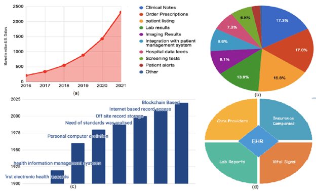

Blockchain is a technology that uses encryption to link digital information, or "blocks," to form an open, distributed digital record or ledger. That ledger effectively, permanently, and verifiably records the money exchanges between the parties. Transactions are faster, more streamlined, and more straightforward for everyone involved when transactions and data can flow uninterruptedly through all the parties involved. 

Blockchain applications in any transaction are safer, transparent, and effective. So it can be the solution to some of the critical factors that run the healthcare system, e.g., supply chain transparency, patient-centric electronic health records, smart contracts for insurance and supply chain settlements, medical staff credentials verifications, IoT security for remote monitoring, etc. Today, first, I’ll cover some basic blockchain concepts and then discuss how we can solve significant healthcare industry problems via Blockchain. 

## Basic Blocchain Concept

We are becoming aware of blockchain every day. Let’s look at the history of NFT. NFTs are digital assets. You can buy art, music, games, etc., digitally.  But you’ll probably ask yourself that if you buy these digital assets, they can be copied or manipulated, and there might not be any way to prove that the digital asset you bought might not have any value. But here’s the thing, with blockchain, NFT can remain unique. That means you’ll have the technology to verify that the original piece only belongs to you. NFTs were largely propelled in 2021. After the boom of NFTs, people have become more aware of blockchain.

 

In the earlier days, we used to keep written ledgers for transactions and maintained them in a financial organization. Those with privileged access may audit traditional ledgers, nevertheless. Blockchain is like these ideas. It eliminated the confidentiality of handling information, specifically transaction data. 

You must’ve heard about Bitcoin by 2022. But if you haven’t, it’s a cryptocurrency. It’s a virtual currency that is mapped out to act as money and a form of payment. It isn’t controlled by anyone, any group, or any entity. Therefore, it has already made it unnecessary for third parties to be involved in financial transactions. Since Satoshi Nakamoto made Bitcoin public in 2009, it has been the most widely used cryptocurrency. Cryptocurrency is present in a blockchain as well as the network that powers it. A blockchain, also known as a distributed ledger, is a popular database that holds data. The blockchain protects data using encryption methods.

When a transaction happens on the system, data from the previous block is copied to a new block along with the new data encrypted, and the transaction is then verified by validators, or miners, in the network. Once a transaction has been confirmed, a new block is created and given as a reward to the miner(s) that verified the data in the block. They are then free to use, hold, or sell the new Bitcoin. Each user has a copy of the ledger as a result, and sophisticated algorithms are used to encrypt the data contained in the blocks. Blockchain enables each of these procedures. As a result, we can now define a blockchain as a set of connected records that are highly resistant to alteration and encrypted for security.

## How Blockchains’ security can gain trust in healthcare

We see security breaches every year, and that leads to costing healthcare companies millions or even billions of dollars. The biggest problems in population health management to date have involved data sharing, privacy, and interoperability. For this problem, blockchain technology is dependable. This technology enhances security, data exchange, interoperability, integrity, real-time updating, and access when appropriately used. Data security is another major concern, especially in the context of wearable technology and personalized medicine. Since patients and medical personnel require straightforward, secure methods of data collection, transmission, and consultation via networks without security concerns, blockchain technology is used to address these issues.

Blockchain acts strongly in altering, and it is shielded by cryptography. These processes of advanced cryptographic algorithms and mathematical challenges are used to safeguard blockchains. Most cryptocurrency systems use the basic framework of blockchain technology. It stops digital money from being duplicated or destroyed. 
There are two most important things that form the foundation for data security in blockchain networks. Consensus and immutability, when combined, build the basics of a secure blockchain network. Immutability guarantees the authenticity of each fresh block of data and the accuracy of transaction records. Contrarily, consensus procedures ensure that the system's rules are followed and that everyone participating concurs with the network's current state.

A distributed blockchain network's nodes' ability to agree on the network's current state and the veracity of transactions is referred to as consensus. The administration of blockchain and the processes of agreement define the legitimacy of transactions. In the health sector, there are many consensus methods that may be used. Blockchain achieves immutability using cryptographic hashes. Since a hash is hard to reverse engineer, it is the main benefit of employing one. The most often used operation is SHA-256.
So, using consensus and immutability, Blockchain can keep an authentic and transparent log of patient data and hospital records secured. 

## So, how do we utilize Blockchain in healthcare?

The idea of applying blockchain technology is no longer restricted to a small number of businesses. What began in 2009 with cryptocurrencies has advanced significantly since then. Due to its ability to conduct safe transactions, it has potential in sectors like banking, where security is a major problem for digital transformation. Due to the numerous potential applications for the healthcare sector, executives in the sector are now waking up to this call and looking at methods to embrace technology.

From industry to consumer, the entire procedure can be verifiable by the technological advantages of blockchain. Every step, like freight direction, traffic, and speed, can be tracked by IoT and Blockchain. Purchases can now be planned accordingly and effectively, thus eliminating unwanted delays and shortages of drug supplies and other related equipment in pharmacies and medical services. Blockchain can ensure unrecognized modification to logistics data with digital blockchain-based frameworks.

It boosts trust around the ecosystem and discourages anyone who is willing to disrupt the divine cause of serving healthcare services. Because altering information, medication, and funds unlawfully would be impossible. Thus, it improves patients' health, keeping healthcare service costs low. It removes all obstacles and limits for multi-level authentication.

While being transparent and private, blockchain can handle sensitive medical data and conceal any identity. Its decentralized nature can be used to nurture patients, physicians, and professionals' information to share quickly and securely. 

For example, MedRec is an open-source prototype for a blockchain-based electronic medical record system that utilizes smart contracts to enable secure and transparent sharing of patient data among different healthcare providers. MedRec is designed to improve data accessibility and interoperability, while also ensuring patient privacy and security. Another example is the use of blockchain in the supply chain of pharmaceuticals. By using blockchain, it is possible to trace the origin of a drug and ensure that it is authentic and has not been tampered with. This can help to prevent the sale of counterfeit drugs and ensure that patients receive the correct medication.

## What does the future look like? 

The future of blockchain in healthcare looks promising, as the technology has the potential to solve many of the challenges currently faced by the industry. Some potential future applications of blockchain in healthcare include:
*	Electronic Health Records (EHRs): Blockchain can provide a secure and decentralized way to store and share patient data, making it easier for healthcare providers to access and share patient information.
*	Clinical Trials: Blockchain can be used to track and manage the data generated during clinical trials, improving the efficiency and accuracy of the trial process securely and transparently.
*	Drug Supply Chain: Blockchain can be used to track the movement of drugs from the manufacturer to the patient, helping to prevent counterfeit drugs and improve the safety of the drug supply chain.
*	Medical Research: Blockchain can be used to securely store and share large amounts of medical data, making it easier for researchers to access and analyze data for medical discoveries.
*	Medical Identity: Blockchain can be used to create secure digital identities for patients, making it easier for patients to control and share their personal health information with authorized healthcare providers.

Although there are many opportunities presented by blockchain technology for the healthcare industry, it is not yet fully developed and cannot be used as a quick fix. Before a healthcare blockchain is adopted by organizations internationally, several technical, organizational, and behavioral economics challenges need to be solved. The figure below shows the uses of different Electronic Health Records and the changes in technology that evolved over the years.

 

By enabling trustless collaboration, reducing complexity, and producing secure, immutable information, blockchain technology offers uncommon opportunities. But there’s insufficient expertise in developing this advanced technology for medical facilities. To optimize information exchange while maintaining patient safety, solutions must be decentralized and involve a large group of multidisciplinary experts, including healthcare providers, lawyers, technology developers, and patients. 

This is similar to how blockchain fundamentally opposes a siloed approach through its decentralization principles. Also, blockchain is in the early stage of development and must evolve into something more tangible to make it a solution for healthcare. Nonetheless, it still promises a lot to give in the upcoming days. 

It's worth noting that these are potential future applications and to fully realize the potential of blockchain in healthcare, it will require the cooperation of many stakeholders such as healthcare providers, government, pharmaceutical companies, and technology companies to build the necessary infrastructure and develop standards for data sharing. Additionally, regulatory compliance and data privacy laws will need to be considered when implementing blockchain solutions in healthcare.

## Conclusion

Blockchain technology has the potential to revolutionize the healthcare industry by providing secure, tamper-proof, and decentralized solutions for storing and sharing patient data. It can also enable improved data privacy and security, as well as more efficient clinical trials and drug development. However, it is important to note that the healthcare industry is heavily regulated and implementing blockchain solutions will require careful consideration of regulatory compliance and data privacy laws. Additionally, widespread adoption of blockchain in healthcare will require a significant investment in infrastructure and education. Despite these challenges, the benefits of blockchain in healthcare are significant and it is likely that we will see more and more healthcare organizations begin to adopt this technology in the coming years.

## References
* https://stlpartners.com/articles/digital-health/5-blockchain-healthcare-use-cases/
* https://www.grandviewresearch.com/static/img/research/us-cryptocurrency-exchange-platform-market.png
* https://www.investopedia.com/terms/b/bitcoin.asp?ad=dirN&lgl=term-video-baseline&o=40186&optly_redirect=integrated&qo=investopediaSiteSearch&qsrc=0
* https://scholarlyoa.com/traders-should-know-about-bitcoin-transactions/
* https://www.cbinsights.com/research/report/blockchain-technology-healthcare-disruption/